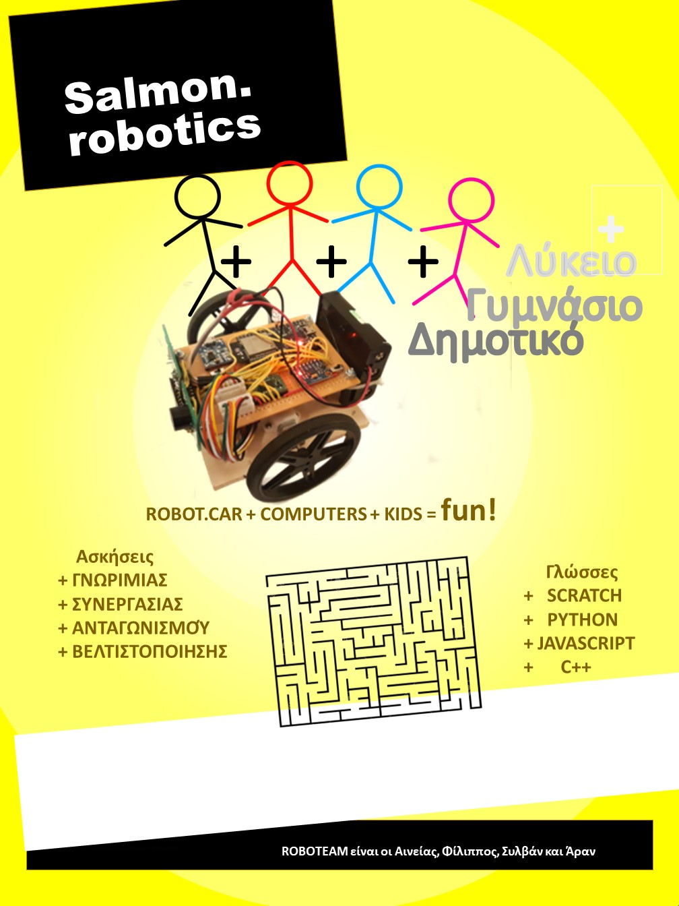

# Salmon Robotics - Mighty Mouse

Entry for the [1ST PANHELLENIC OPEN ROBOTICS COMPETITION](https://robotics.ellak.gr/).

A 2 wheeled robot programmed via C++, Python, JavaScript and Scratch.

Το υλισμικό του Robo-Car αποτελείται απο ένα microcontroller συμβατό με Arduino, ασύρματη επικοινωνία, motor driver, motors, wheel encoders, αισθητήρα απόστασης, διεύθυνσης (γυροσκόπιο), λυχνίες, μπίπ και power regulators.

(Click στην εικόνα για demo video)

(Click στην εικόνα για demo video)

(Click στην εικόνα για demo video)

(Click στην εικόνα για demo video)
