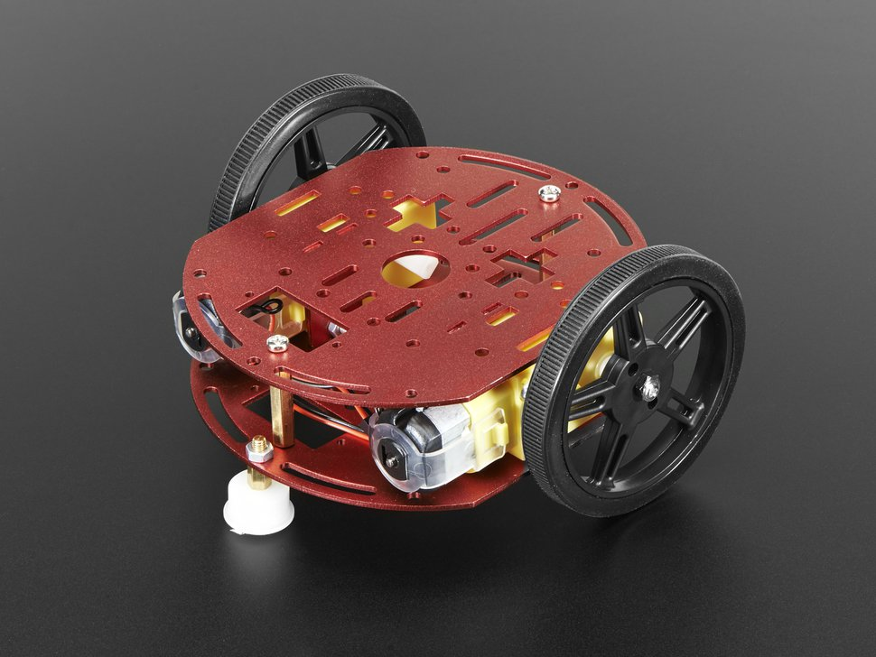
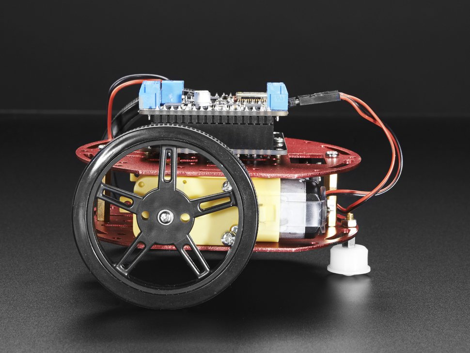
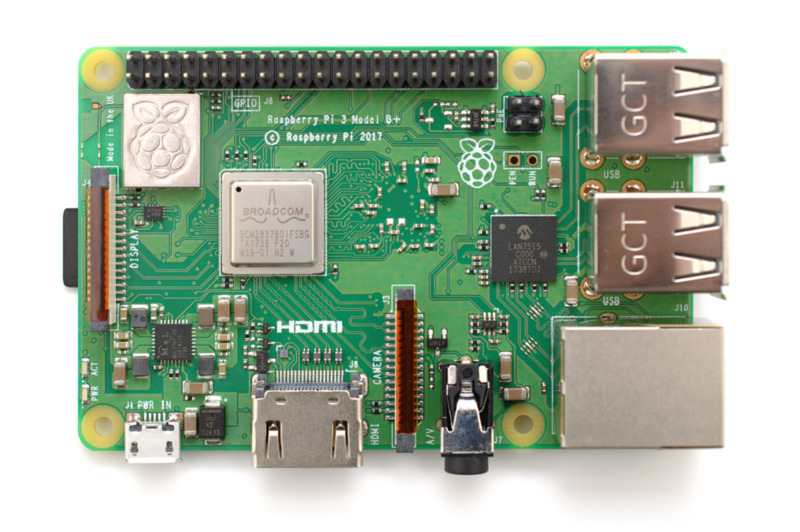

# Salmon Robotics

Entry for the 1ST PANHELLENIC OPEN ROBOTICS COMPETITION.

A 2 wheeled robot programmed via Scratch.

Robot hardware consists of an Arduino based microcontroller, wireless communications, motor driver, motors, wheel encoders, proximity senosor, visual and audio indicators, power management.

Output Control
--------------

2 motors for motion

1 servo for sensor direction

3 LEDs as indicators

1 speaker for audio notifications

Input Sensors
-------------

Ultrasonic ranging module

Wheel encoders

Arduino/Scratch Bridge
----------------------

A Raspberry Pi is used as a bridge for the communications between the robot and Scratch instances on multiple computers.

Using Scratch in Mesh mode, multiple users can interact and program the robot.

