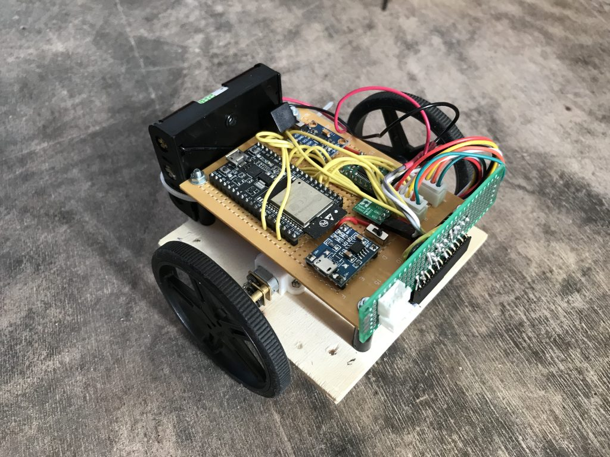
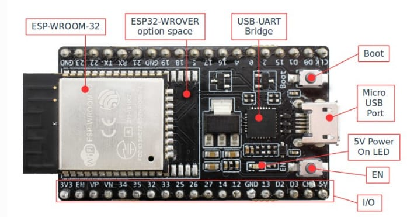

# Mighty Mouse

The main hardware components are:

* [ESP32 microcontroller](#esp)
* Motor Driver
* Voltage Regulator
* Motors
* Encoders
* Wheels
* Power Source

##ESP32
ESP32 microcontroller is a low cost, low power system on a chip with integrated Wi-Fi.

[ESP32 Info](https://www.espressif.com/en/products/hardware/esp32-devkitc/overview)

[Shop](https://grobotronics.com/esp32-development-board-esp32-devkitc-32d.html)

