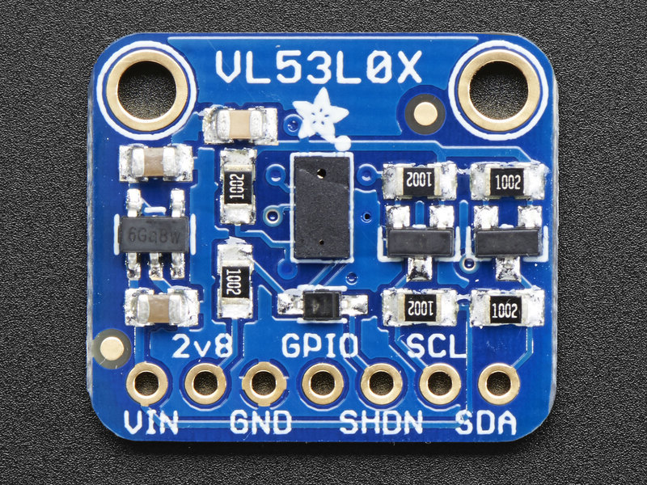

# Mighty Mouse

The main hardware components are:

* [ESP32 microcontroller](#esp32)
* [Adafruit VL53L0X Time of Flight Distance Sensor](#Adafruit-VL53L0X)
* Motor Driver
* Voltage Regulator
* Motors
* Encoders
* Wheels
* Power Source

## ESP32

ESP32 microcontroller is a low cost, low power system on a chip with integrated Wi-Fi.

[ESP32 Info](https://www.espressif.com/en/products/hardware/esp32-devkitc/overview)

[Shop](https://grobotronics.com/esp32-development-board-esp32-devkitc-32d.html)

[TOP](#mighty-mouse)

## Adafruit VL53L0X 

The Adafruit VL53L0X Time of Flight Micro-LIDAR Distance Sensor Breakout is a distance sensor.

[Adafruit VL53L0X Info](https://learn.adafruit.com/adafruit-vl53l0x-micro-lidar-distance-sensor-breakout)

[Shop](https://grobotronics.com/adafruit-vl53l0x-time-of-flight-distance-sensor-30-to-1000mm.html)

[TOP](#mighty-mouse)
