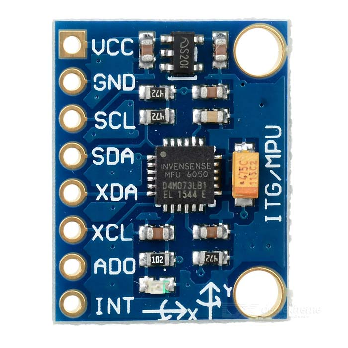
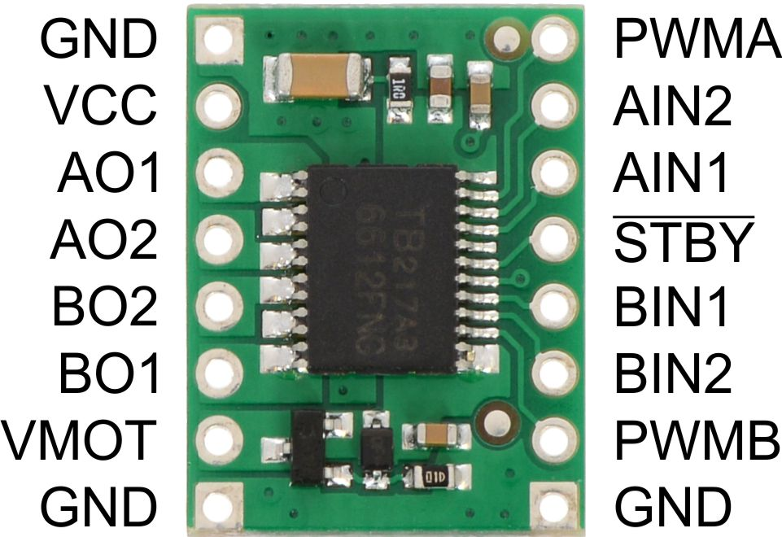
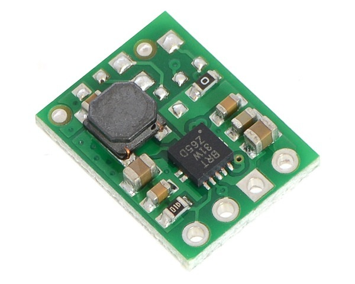
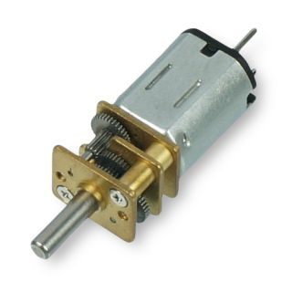
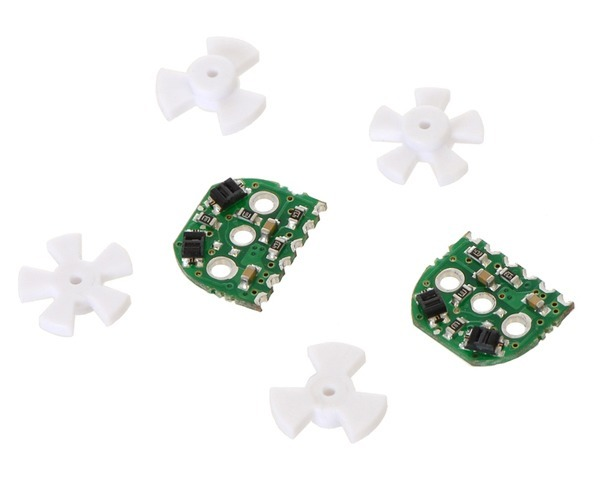
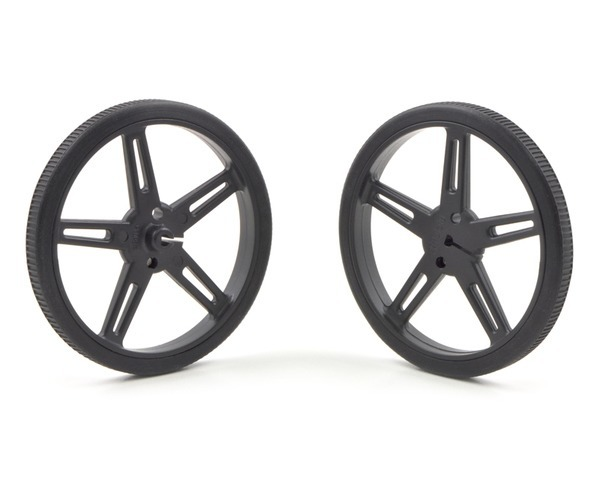
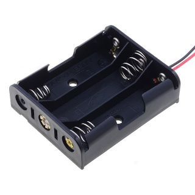

# Mighty Mouse

The main hardware components are:

* [ESP32 microcontroller](#esp32)
* [Adafruit VL53L0X Time of Flight Distance Sensor](#Adafruit-VL53L0X)
* [Gyroscope](#Gyroscope)
* [TB6612FNG Dual Motor Driver Carrier](#TB6612FNG-Dual-Motor-Driver-Carrier)
* [Voltage Regulator](#Pololu-Voltage-Regulator)
* [Motors](#Micro-Metal-Gearmotors)
* [Encoders](#Encoder-Pair-Kit)
* [Wheels](#wheels)
* [Power Source](#power)
* [Misc](#misc)

## ESP32

ESP32 microcontroller is a low cost, low power system on a chip with integrated Wi-Fi.

[More Info](https://www.espressif.com/en/products/hardware/esp32-devkitc/overview)

[Shop](https://grobotronics.com/esp32-development-board-esp32-devkitc-32d.html)

[TOP](#mighty-mouse)

## Adafruit VL53L0X 

The Adafruit VL53L0X Time of Flight Micro-LIDAR Distance Sensor Breakout is a distance sensor.

[More Info](https://learn.adafruit.com/adafruit-vl53l0x-micro-lidar-distance-sensor-breakout)

[Shop](https://grobotronics.com/adafruit-vl53l0x-time-of-flight-distance-sensor-30-to-1000mm.html)

[TOP](#mighty-mouse)

## Gyroscope 

[More Info](https://www.invensense.com/products/motion-tracking/6-axis/mpu-6050/)

[Shop](https://grobotronics.com/gy-521-mpu6050-3-axis-gyroscope-and-accelerometer-imu.html)

[TOP](#mighty-mouse)

## TB6612FNG Dual Motor Driver Carrier 

Motor driver which can independently control two bidirectional DC motors.

[More Info](https://www.pololu.com/product/713/)

[Shop](https://grobotronics.com/tb6612fng-dual-motor-driver-carrier.html)

[TOP](#mighty-mouse)

## Pololu Voltage Regulator 

Voltage regulator to pump up the power to 5V.

[More Info](https://www.pololu.com/product/2562/)

[Shop](https://grobotronics.com/pololu-5v-1.4a-step-up-voltage-regulator-u3v12f5-2115.html)

[TOP](#mighty-mouse)

## Micro Metal Gearmotors 

Micro Metal Gearmotors with Extended back shaft to add encoders.
Speed around 420RPM.

[More Info](https://www.pololu.com/product/2562/)

[Shop](https://grobotronics.com/micro-metal-gearmotor-extended-back-shaft-420rpm.html)

[TOP](#mighty-mouse)

## Encoder Pair Kit

[More Info](https://www.pololu.com/product/2591)

[Shop](https://grobotronics.com/magnetic-encoder-pair-kit-12-cpr-2.7-18v-hpcb-compatible.html)

[TOP](#mighty-mouse)

## Wheels

[More Info](https://www.pololu.com/product/1425)

[Shop](https://grobotronics.com/pololu-wheel-70x8mm-pair-black.html)

[TOP](#mighty-mouse)

## Power

[More Info](https://grobotronics.com/3x-with-wires.html)

[Shop](https://grobotronics.com/3x-with-wires.html)

[TOP](#mighty-mouse)

## Misc

Motor brackets, switches, connectors, chassis, prototyping board, solder, wires,etc.

