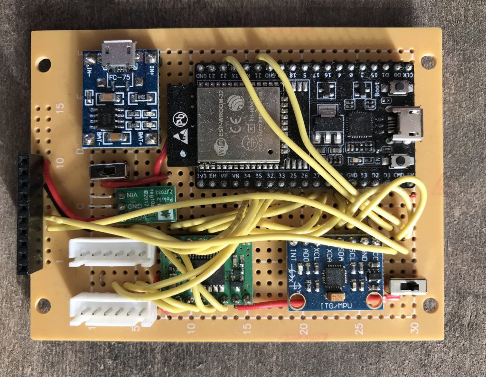
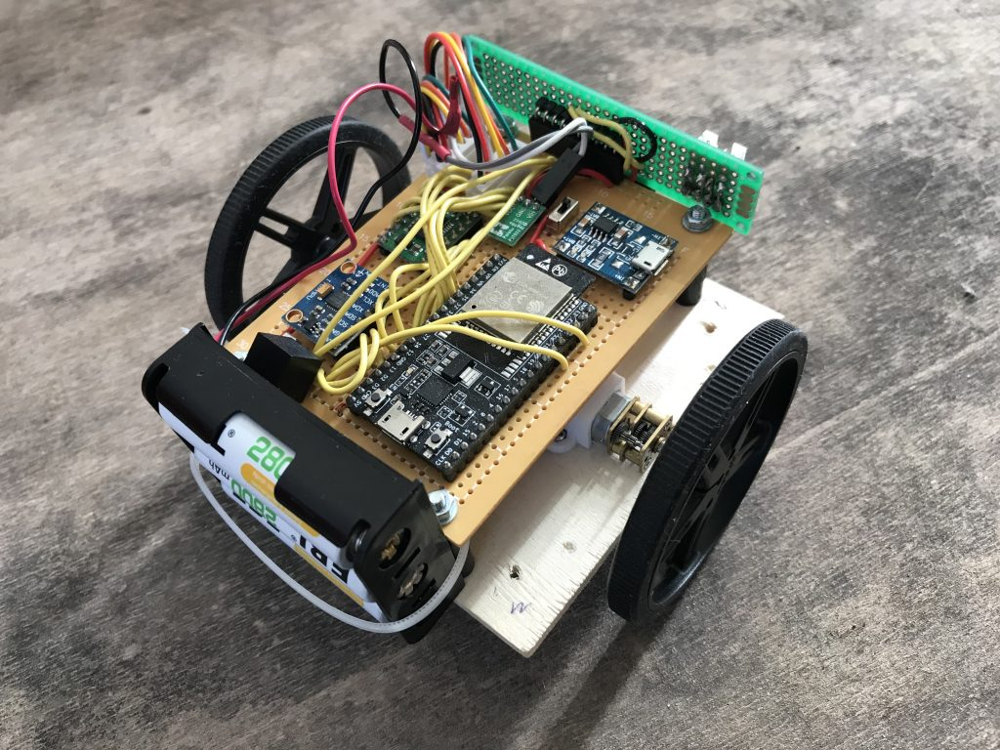

# Construction Overview

```
led_pin = 16 

encoder1_a_pin = 33 
encoder1_b_pin = 32 
encoder2_a_pin = 35 
encoder2_b_pin = 34 


motor1_pin = 25 
motor1_in2_pin = 27 
motor1_in1_pin = 26 

motor2_pin = 12 
motor2_in1_pin = 13 
motor2_in2_pin = 14 

IMU -> i2c ( pins 21 , 22 ) 

VL53L0X -> i2c ( pins 21 , 22 )
```





